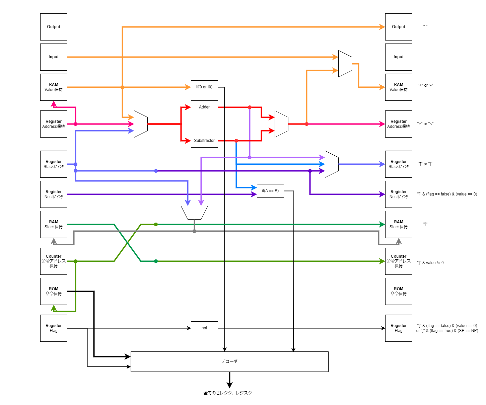

# BFprojの目的

本プロジェクトはBrainfuckを命令で動作するコンピュータを作成することをゴールとする。

## 仕様

### 命令セット

命令は3bitで表す。

| Binary | Instruction | Description                                                        |
| ------ | ----------- | ------------------------------------------------------------------ |
| 000    | >           | ポインタをインクリメントする。                                     |
| 001    | <           | ポインタをデクリメントする。                                       |
| 010    | +           | ポインタが指す値をインクリメントする。                             |
| 011    | -           | ポインタが指す値をデクリメントする。                               |
| 100    | [           | ポインタが指す値が0なら、対応する `]` の直後にジャンプする。       |
| 101    | ]           | ポインタが指す値が0でないなら、対応する `[` の直後にジャンプする。 |
| 110    | ,           | 入力から1バイト読み込み、ポインタが指す先に書き込む。              |
| 111    | .           | ポインタが指す値を出力に書き出す。                                 |

ToDo:

- 8つの命令のビット列が決まっている

### アーキテクチャ

#### 全体アーキテクチャ

- ROM: 命令を保存するメモリ。プログラム実行前に書き込む。
- Selector (セレクタ): 複数のバスから制御ビットに従って1つのバスを流すもの。
- デコーダ: 命令を解釈してセレクタに繋げる。
- RAM: 変数を保存するメモリ。
- Adder, Substracotor: 値を+1もしくは-1する算術論理演算器
- SP (Stack Pointer): ループにおける戻るべき`[`のポインタ (ループは入れ子になるのでstackに積む)
- NP (Nest Poineter): ループのスキップをはじめた`[`のポインタ
- Flag: ループをスキップをするかを管理するフラグ

#### デコーダの実装

台形がセレクタを示している。デコーダは命令に応じて各セレクタを制御する。

#### stackに関する説明

0. ループの中に入る。`SP`を+1し、`stack`にアドレスを書き込む。
1. ループの中に入る。`SP`を+1し、`stack`にアドレスを書き込む。
2. `value`が0なのでループをスキップする。現在の`SP`を`NP`に書き込み、`SP`を+1して`stack`にアドレスを書き込む。スキップするループに入っている`flag`を立てる。
3. `SP`を-1する。`NP`と`SP`が等しいので、2.に対応する`]`である。`flag`を降ろす。
4. `value`が0なのでループを出る。`SP`を-1する。
5. `value`が0以外なので`SP`が指すアドレスの直後にジャンプする。

注意点
- 5.において、図では1に飛ぶべきだが、多くの場面では`[`と`[`にも命令があるので、`[`の直後の命令が実行される。

以下メモ

思想: デコーダは命令を解釈して、レジスタの書き込み条件とセレクタを制御する

アーキテクチャは次の図に示す。

Memo: レジスタに書き込む条件

- RAM (valueの保持): 命令が `+` or `-` のとき
- AR (AddressのRegister): 命令が `<` or `>` のとき
- SP (Stack Pointer): 命令が `[` or  `]` のとき
- NP (Nest Pointer): 命令 `[` かつ Flag == false かつ value == 0 のとき  <- つまり、 `]` の次までジャンプせよのとき
- RAM (stackの保持): 命令が `[` のとき
- IAR (命令アドレス保持): 命令が `]` かつ value != 0 のとき <- つまり、 `[` の次までジャンプせよのとき
- SF (Skip Flag): 命令が `[` かつ (Flag == false かつ value == 0 )  or ( `]` かつ Flag == true かつ SP == NP )のとき  <- つまり、フラグを立てる(ネストに入る)ときとフラグを下ろすとき(ネストから出る)とき

Memo: セレクタに渡す条件

1. ALUに渡す部分
    - RAM (value): 命令が `+` or `-` のとき
    - AR: 命令が `<` or `>` のとき
    - SP: 命令が `[` or  `]` のとき
2. ALUの出力 (LOOP以外)
    - Adder: 命令が `+` or `>` のとき
    - Substractor: 命令が `-` or `<` のとき
3. RAMへの書き込み
    - Input: 命令が `,` のとき
    - ALU: 命令が `+` or `-` のとき
4. ALUの出力 (LOOP)
    - Adder: `[`
    - Substractor: `]` かつ value == 0
    - SP:  `]` かつ value != 0  <- ジャンプするよー

ToDo:

- 回路図を添付できている。
- 命令ごとにデータが流れるフローを図と文で説明できている
- クロックをつけて動作のフローを理解できている。

### 論理回路図

ToDo:

- 全体アーキテクチャをコンポーネント単位に分割できている
- コンポーネント単位で回路図の作成ができている
- コンポーネント単位でテストができている
- コンポーネントを繋げて全体が動作している

# Hardware

コンポーネント

- ALU: `283` (adder)を使う。+1と-1の切り替えは補数(notとcarryで制御)を使う。
- セレクタ: `153`や`157`を複数使って8bitにセレクタを実現する。
- 比較(8bitの==のみ): XORのNAND
- 

カウンタ
161
- レジスタ: 2個 (4bit x 2 = 8bit) x 5レジスタ = 10個
- カウンタ: 4個 (4bit x 4 = 16bit) = 4個
最低14個

283(Full Adder)
- ALU: 2個

最低2個

4030 (XOR)

74HC04 (NOT)

74HC08 (AND)

74HC32 (OR)

74HC00 (NAND)

74HC74 D-FF
Flag  1個

メモリは人に相談
ROMとRAMは人に聞く

# ロードマップ

- 全体アーキテクチャが作成できている
- 論理回路図が作成できている
- 部品込みの回路図が作成できている
- ハードウェアアーキテクチャが決まっている
- 基板作成ができている
- 部品調達ができている
- マシンが完成している

