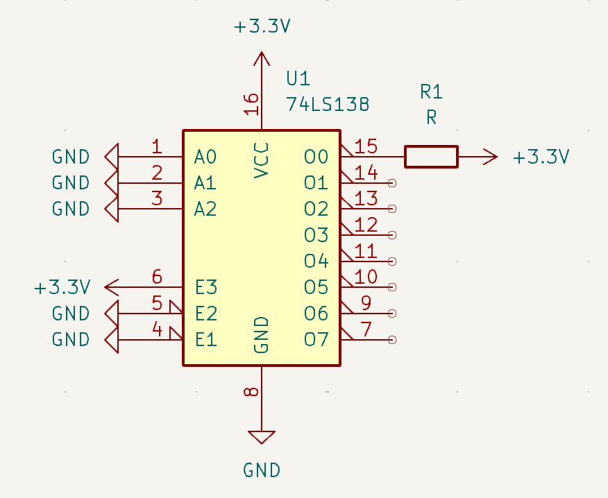
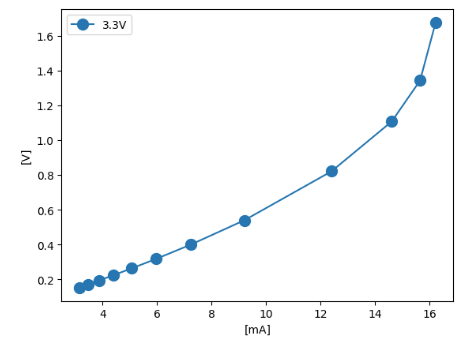

# 実験の目的

16mAだとどれほど電圧降下するか調べるために、デコーダの電圧降下の実験を行った。

# 実験方法

デコーダの出力ピンに流れる電流と電圧の関係を測定した。実験には次の回路を使用した。このデコーダは負論理なので0番ピンに電流を流し込んでいる。この回路において、抵抗を変えたときの抵抗間の電圧を測定し、電流を算出した。回路図は下の図のとおりである。

# 実験結果

下の図は、3.3Vで動作するデコーダの出力ピンに流れる電流値とLow-levelの電圧値の関係を示した図である。

この実験の結果から、LEDを光らせるために必要な16mA程度の電流をデコーダから流そうとすると1.6V程度の電圧降下が発生するわかった。
