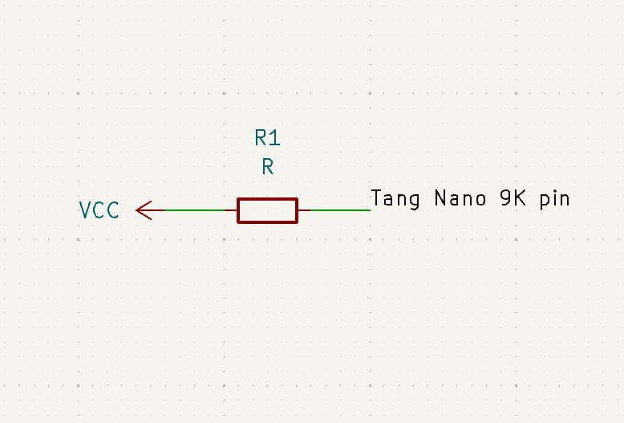
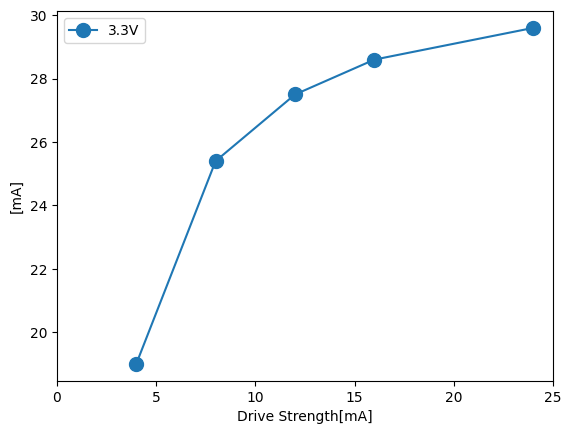
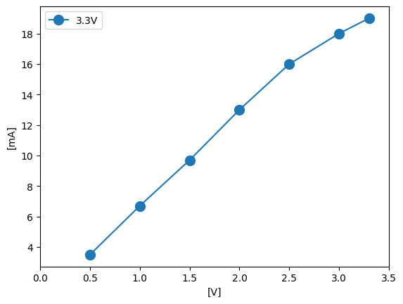

# 実験の目的

Tang Nano 9Kのドライブストレングスを設定したときの駆動電流の安定性を調べるための実験を行った。

# 実験方法

本実験ではドライブストレングスの特性について調べるために二つの実験を行った。
1. Tang Nano 9Kの出力ピンを100Ωの抵抗Rを介してVCC(3.3V)につなぎ、出力ピンは0を出力し、ドライブストレングスを変えたのち抵抗R両端の電圧を測定した。
2. Tang Nano 9Kの出力ピンを100Ωの抵抗Rを介してVCCにつなぎ、出力ピンは0を出力し、VCCの値を変更したのち抵抗R両端の電圧を測定した。

回路図は以下のとおりである

# 実験結果

実験1
下の図は、100Ωにおける各ドライブストレングスと実際に流れた電流値の関係を示した図である。

実験2
下の図は、ドライブストレングス4mA、R=100Ωにおける、電源電圧と電流値の関係を示した図である。

これらの実験結果から、ドライブストレングスの値によって電圧はある程度小さくなるが、どのドライブストレングスでも電流値は一定にならないことがわかる。
