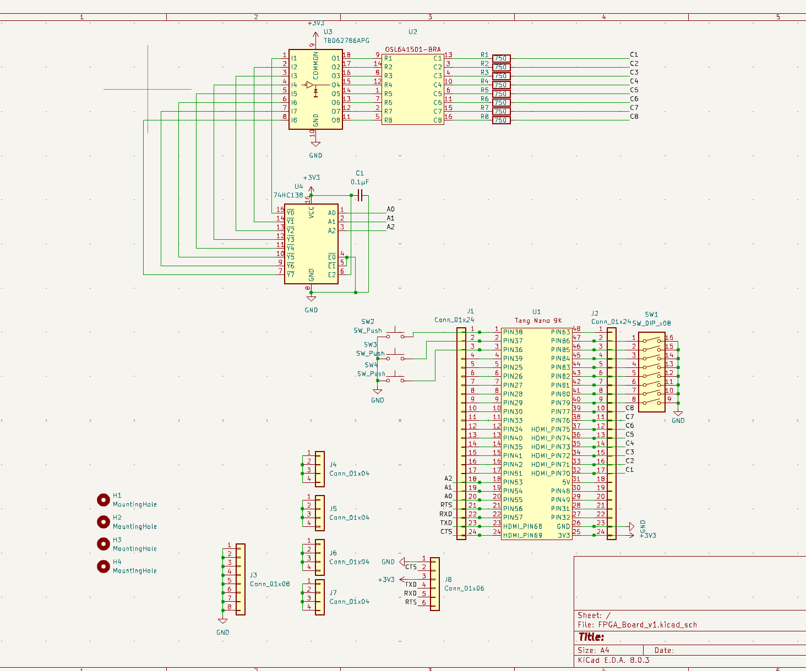
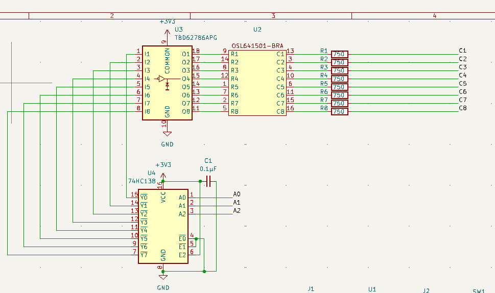
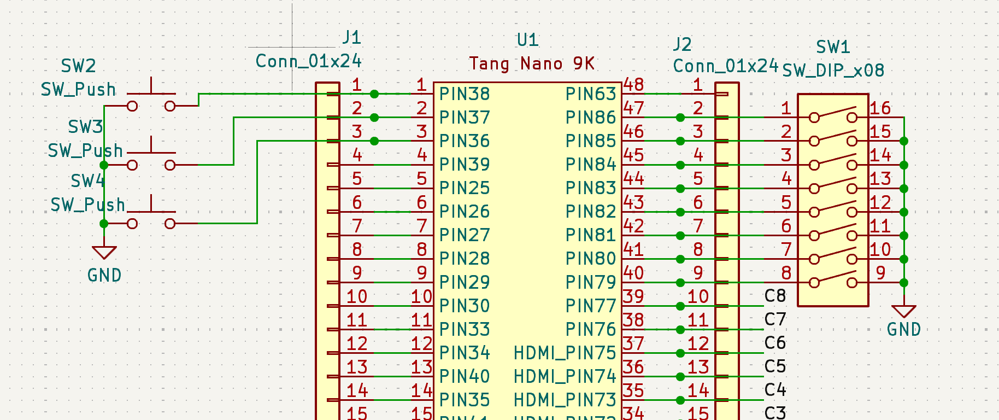
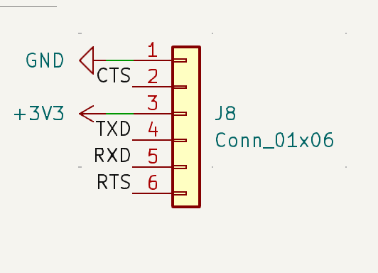
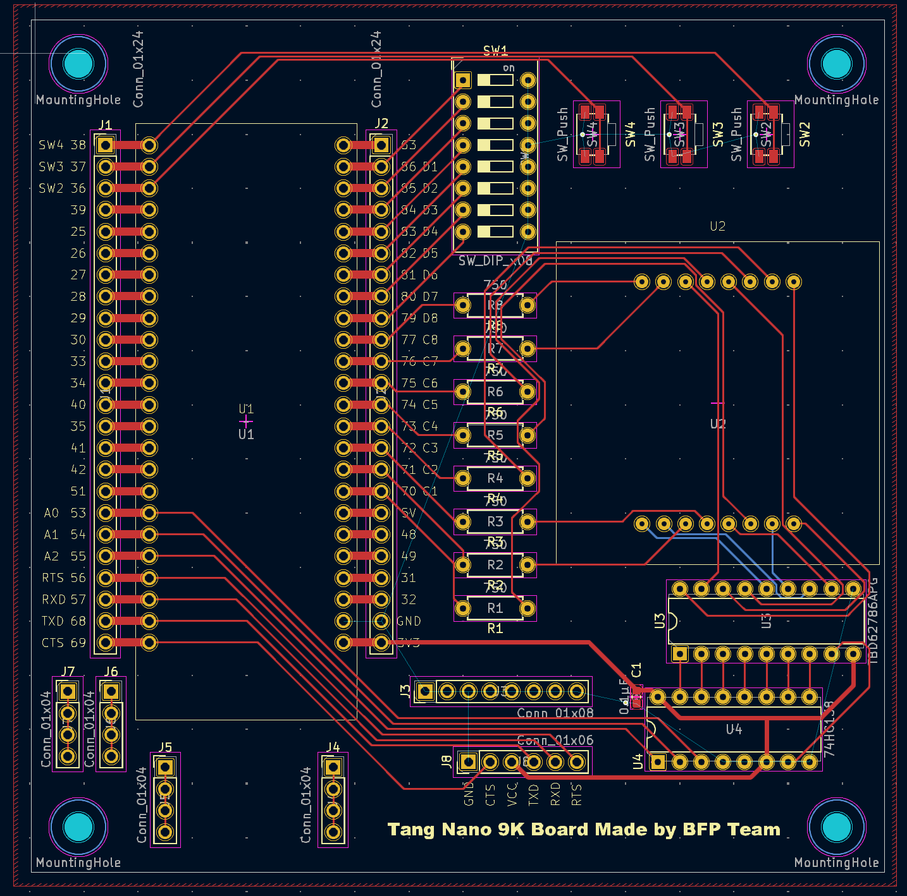

# Tang Nano 9K Board

## ボードを作ろうとした目的

BF CPUをFPGA(Tang Nano 9K)に実装するときに、動作を検証する必要がある。
そのときに毎回入出力用の回路を組むのは手間なので、Tang Nano 9Kを差し込むだけでIO機能が使えるようなボードを作成することにした。

## 部品一覧

必要な部品の一覧は下の表に示す。

| 部品                                        | 目的                                                            | 個数 | 
| ------------------------------------------- | --------------------------------------------------------------- | ---- | 
| Tang Nano 9K                                | FPGA本体                                                        | 1    | 
| 3to8 ラインデコーダー (TC74HC138AP)            | マトリクスLEDの入力を節約するため                               | 1    | 
| 8chDMOSトランジスターアレイ (TBD62786APG) | マトリクスLEDの電流増幅用                                       | 1    | 
| カーボン抵抗(炭素皮膜抵抗) (1/8W750Ω)        | マトリクスLEDの抵抗                                             | 1    | 
| 8x8マトリクスLED(赤) (OSL641501-BRA) | デバッグ用                                                      | 1    | 
| 表面実装用タクトスイッチ (TS-06104)           | デバッグ用の入力                                                | 3    | 
| DIPスイッチ 8P (EDS108SZ)                              | デバッグ用の入力                                                | 1    | 
| 分割ロングピンソケット 1×42          | Tang Nano 9Kを使い回せるようにするため、GPIOピンを設置するため | 3    | 

## 回路と使用部品の説明

全体の回路図は下の図のとおりである。

### 1. Tang Nano 9K
高価な部品のため、はんだ付けするのはピンソケットだけにし、そこにTang Nano 9K を差し込む形にする。

### 2. マトリクスLED制御回路

#### マトリクスLED導入の目的
用途はテスト時の出力のである。CPUを扱う場合、レジスタの値などを出力することが多くなるため、少ないピンで大量の情報を出力できる8×8ドットマトリクスLEDを出力機器に選択した。

#### 制御方法
3to8デコーダを介することでマトリクスLEDの行側を3ピンで制御し、列側はTang Nano 9Kの8ピンで直接制御する。マトリクスLEDは3to8デコーダの入力を制御させることで、8つの行を瞬時に切り替えて点灯させている(ダイナミック点灯)。

マトリクスLEDの行側はPch MOSFETのアレイを使って電流の増幅をしている。マトリクスLEDの列側の配線はダイナミック点灯時に適度な明るさになるような750Ωの抵抗を挟んでGPIOピンに引き込んだ。

#### 設計の経緯

##### 設計における前提
- マトリクスLEDをダイナミック点灯で制御する。
- マトリクスLEDの制御にはデコーダを使い、できるだけ使用するピン数を少なくする。

##### 使用するマトリクスLEDの決定
できるだけ少ない電流で点灯させるため、高輝度のLEDマトリクスを選んだ。

##### マトリクスLEDに流す電流値の決定方法

マトリクスLEDをダイナミック点灯させたときに、明るすぎず暗すぎない適切な明るさで光るような電流値を算出した。

次の手順で必要な電流値を決めた。

- どれくらいの明るさで光らせるか
- その明るさを光らせるために必要な電流値
- ダイナミック点灯を考慮した必要な電流値

このフォーラムから、一つのLEDを1mcdで光らせると適切な明るさになることが判明した。

LEDの光度に関する言及: [LEDの明るさ調整 - 506: 照明 - Forum - Vault Archive - Renesas Community](https://community-ja.renesas.com/cafe_rene/forums-groups/the_vault/f/forum2/702/led/10408#10408)

次に、マトリクスLEDのデータシートを見ると、20mAを流したとき100mcdになることがわかった。電流と光度は比例関係になると知られているので、1mcd光らせるには0.2mA必要であることがわかる。

マトリクスLEDのデータシート: [Microsoft Word - OSL641501-XX_VER A.1.2](https://akizukidenshi.com/goodsaffix/OSL641501-XX_VER_A.1.2.pdf)

ダイナミック点灯することによって、1つのLEDが光る時間が本来の1/(行数)になってしまう。今回は8行あるの点灯時間が1/8になる。しかし、前のMOSFETをOFFにする瞬間に次のMOSFETをONにすると、両方がONになり、想定以上の電流が流れる可能性があるので、OFFとONの間に切り替え時間を設ける。それを考慮して点灯時間を1/10とする。このとき、LEDに本来の10倍の電流を流すことで点灯時間が1/10でも見た目の明るさが1mcd程度になる。

したがって、マトリクスLEDの各行には2mAを流すことにした。行は8つあるので、最大16mAの電流が列に流れることになる。

##### MOSFETの配置や種類の決定方法

MOSFETを使うことによって、GPIOピンに大電流を流すのを回避できる。

考えられる構成は以下の通り。

1. MOSFETを使わない
2. カソード側にNch MOSFETとデコーダを使う -> 採用
3. アノード側にPch MOSFETとデコーダを使う
4. アノード側にPch MOSFETを使い、カソード側にNch MOSFETを使う

まず、1番の場合だと、高電流がデコーダに入力されたときの電圧降下が大きすぎてLEDが光らなくなってしまう。デコーダは数十μA程度の電流なら電圧降下は起きないが、数mAの電流を流すと電圧降下が起きてしまうことがデータシートをみてわかる。

デコーダのデータシート: [TC74HC138AP/AF](https://akizukidenshi.com/goodsaffix/TC74HC138AP.pdf)

16mAだとどれほど電圧降下するか調べるために、デコーダの電圧降下の実験を行った。

[実験の詳細](./Exp_Decoder_Voltage_Drop.md)

この実験の結果から、LEDを光らせるために必要な16mA程度の電流をデコーダから流そうとすると1.6V程度の電圧降下が発生するわかった。したがって、1番の構成を選択することはできない。

2番と3番はデコーダの位置をアノードに置くかカソードに置くかなので、対称的である。この構成ではMOSFETによってデコーダの電圧降下の問題を解決できている。今回使うデコーダの出力は負論理なため、DMOSトランジスタアレイはローアクティブのものでなければならない。2番の構成ではローアクティブのソースタイプDMOSトランジスタアレイ、3番の構成では、ローアクティブのシンクタイプDMOSトランジスタアレイを使うことになるが、ソースタイプのものがが秋月で簡単に入手できるのに対してシンクタイプのものの入手性が悪いので2番の構成を選択した。

2番の構成では、1つのピンに2mA、全体で最大16mAが流れる可能性がある。Tang Nano 9Kのデータシートから許容電流値が判断できなかったが、1つのピンあたり最大で24mAのドライブストレングスを設定できることから2番の構成のままで問題ないと判断した。

また、4番の場合はアノード側、カソード側両方にMOSFETを配置するので各GPIOピンに流れる電流が最も少なくなる。
我々は、実現可能で最もシンプルな2番の構成を採用した。

[Tang Nano 9K - Sipeed Wiki](https://wiki.sipeed.com/hardware/en/tang/Tang-Nano-9K/Nano-9K.html)

また、Pch MOSFETが8個揃ったアレイの素子(e.g. 62086)を使うことで回路のフットプリントの規模を小さくすることができた。

##### 抵抗が必要かどうかの決定

Tang Nano 9Kには各ピンの駆動電流を制御する機能がある。よって、その機能を用いて電流が一定の値に安定すれば、抵抗がいらないと考えられる。
このことについて、Tang Nano 9Kの駆動電流の安定性を調べるための実験を行った。

[実験の詳細](./Exp_Drive_Strength.md)

これらの実験結果から、ドライブストレングスの値によって電圧はある程度小さくなるが、どのドライブストレングスでも電流値は一定にならないことがわかる。したがって、抵抗を介してLEDを点灯させることにした。

##### マトリクスLEDに使う電流制限抵抗の抵抗値の決定方法
抵抗値決定のために、LEDの降下電圧を知る必要がある。MOSFETの降下電圧は非常に小さいため考慮しない。
データシート上だと、20mAのときの降下電圧(2.1V)しかわからなかったため、マトリクスLEDの降下電圧についての実験を行った。

[実験の詳細](./Exp_MatrixLED_Voltage_Drop.md)

マトリクスLEDの降下電圧は2.0mA付近だと1.8Vほどである。
これをもとに電流値が2.0mAになる抵抗値を計算すると、

$$
3.3\text{V} - 1.8\text{V} = 1.5\text{V}
$$

$$
1.5\text{V} \div \text{2mA} = 750 \Omega
$$

となり、750Ωが適切な抵抗となる。さらに、7.5はE24系列に入っているため、入手がしやすい。

※ E系列とは電子部品の定数として使われている等比数列です。許容誤差によって系列が異なりますが、5%の抵抗はE24系列になります。

[E6系列 E12系列 E24系列 E48系列 E96系列 E192系列の一覧表と概略計算方法](http://sim.okawa-denshi.jp/keiretu.htm)

### 3. 入力回路

3つのプッシュスイッチと1つのDIPスイッチをテスト時の入力として採用した。

#### 設計意図
Tang Nano 9Kのピンは内部でプルアップ回路を選択できるのでそれを利用している。
DIPスイッチはFPGAボードの1.8VのバンクのPIN79~86に接続している。3.3Vの回路を主に使うとなると、1.8Vのピンは使いにくいので、入力専用にしている。

#### 部品選定
プッシュスイッチははんだ付けしやすいように表面実装用のものを選択した。
DIPスイッチについては安価なものを選んだ。

### 4. 補助ピン

デバッグ時にTang Nano 9Kのピンをブレッドボードなどを使わずに分岐できるように、内部でそれぞれのピンを繋げたピンソケットを複数配置した。1つはGNDに接地させている。
GNDに接地したピンは電圧を測定するときや、外部でICのテストをするときに役立つ。

### 5. USBシリアル変換モジュール

FPGAに自作CPU向けの機械語を書き込むためのラインを用意した。これは、Windowsを使うときに、Windows本体とWSLでI/Oを共有できないときに役に立つ。今時点ではTang Nano 9KのUSB-Cポート1つで十分なので、実装できるようにピンだけ用意しておき、必要になったときに変換モジュールを差し込むようにする。

## 基板の設計意図

部品配置において考えたこと
- 抵抗に被さらないように部品配置をした
  - LEDの光度が適切でなかったときに取り外しやすいように
- Tang Nano 9Kのコネクタ周りに部品を配置しない
  - コネクタと干渉しないようにした

配線において考えたこと
- 配線は短くする
- 配線は直角に曲げない
- 高電流が流れるところは太い配線を採用する
- 配線はできるだけ表面で完結させる(裏面をベタにするため)

基板の表面と裏面はGNDに接地させている。こうすることによって、GNDの接地の配線を省略したり、ノイズを軽減したりできる。

大きな電流が流れる可能性があるGPIOピンとVCCの系統の配線は他の線よりも太く設定した。

## 追記
基板に部品をはんだ付けした後に、プッシュスイッチ部分の基板のフットプリントが間違っていることが判明した。購入したスイッチの足の間隔よりも、ランドの間隔が半分程度小さくなってしまった。少しはみ出るが、プッシュスイッチを強引にはんだ付けすることでこの問題を解決した。

